# Pipeline Architecture v1
# Krakow Air Quality & Urban Form

> **What this is:** the system sketch from Session 2, evolved with **real
> boxes** now that Session 3 cleaning and feature extraction are real code.
>
> Replaces `system-sketch-v0.md` as the source of truth for implemented components.

---

## What changed since v0

In Session 2, `system-sketch-v0.md` had aspirational boxes — "Download & clean",
"Calculate features", "Spatial join." In Session 3, all of those boxes are
now implemented:

- AQICN 8-station cleaning → `clean_multistation.py` ✅
- Urban Atlas land use feature extraction → `spatial_features_pipeline.py` ✅
- OSM building + road feature extraction → `spatial_features_pipeline.py` ✅
- Merge spatial + temporal → `spatial_features_pipeline.py` ✅

What is still planned:
- Sentinel-2 NDVI/NDBI extraction → pending
- ERA5-Land weather controls → pending
- Rasterize to 100m city-wide grid → pending
- Model training + cross-validation → Session 4
- Dashboard → Session 7

---

## The diagram

```mermaid
flowchart LR
    subgraph raw [Raw Data]
        R1["8 station CSVs<br/>(AQICN downloads)<br/>data/raw/"]
        R2["Sentinel-2 imagery<br/>GEE — ⏳ planned"]
        R3["OpenStreetMap<br/>roads + buildings<br/>(via osmnx API)"]
        R4["ERA5-Land<br/>weather 9km<br/>⏳ planned"]
        R5["CLMS Urban Atlas<br/>KRAKOW .fgb<br/>~150 MB, session 3 root"]
    end

    subgraph clean ["Phase 3 · AQ Cleaning — ✅ IMPLEMENTED<br/>session 3/scripts/clean_multistation.py"]
        C1["load + tag 8 stations<br/>keyword match filenames → station_id"]
        C2["filter date range 2019-2024"]
        C3["remove duplicate (station, date) pairs"]
        C4["drop rows missing PM2.5 target<br/>clip negative values to 0"]
        C5["exclude COVID period<br/>2020-03-15 – 2020-05-31"]
        C6["drop columns >50% missing"]
        C7["impute remaining pollutants<br/>per-station median"]
        C8["add temporal features<br/>month/doy cyclical, season dummies<br/>PM2.5 lag1/3/7, rolling7d"]
        C9["drop lag cold-start rows<br/>reset index"]
    end

    subgraph features ["Phase 3 · Feature Extraction — ✅ IMPLEMENTED<br/>session 3/scripts/spatial_features_pipeline.py"]
        F1["compute_landuse_features<br/>Urban Atlas at 0.5/1/2/5 km radii<br/>green_pct, urban_pct, seal_density<br/>+ 10 category % columns"]
        F2["compute_osm_features<br/>building coverage + count/km²<br/>road density km/km²<br/>at 0.5/1/2 km radii"]
        F3["merge spatial + AQ<br/>broadcast station features<br/>to all time rows"]
    end

    subgraph pending ["Pending · Future Sessions"]
        FP1["calculate_ndvi_ndbi<br/>Sentinel-2 — ⏳ Session 4"]
        FP2["extract_era5_monthly<br/>weather controls — ⏳ Session 4"]
        FP3["rasterize to 100m grid<br/>city-wide prediction — ⏳ Session 4"]
    end

    subgraph processed [Processed / Output Files]
        P1["krakow_multistation_CLEANED.csv<br/>data/processed/<br/>daily rows, 8 stations, 27+ cols"]
        P2["krakow_spatial_features.csv<br/>data/output/<br/>8 rows × 53 cols (one per station)"]
        P3["krakow_final_dataset.csv<br/>data/output/<br/>ML-ready merged dataset"]
    end

    subgraph future ["Future · Phase 4–7"]
        M1["train_model<br/>Session 4<br/>Random Forest PM2.5 ~ features"]
        M2["leave-one-station-out CV<br/>Session 4<br/>8 folds, target R² ≥ 0.40"]
        M3["predict_grid<br/>Session 4<br/>32,700 × 100m cells"]
        M4["rank_interventions<br/>Session 4<br/>scenario modeling"]
        M5["failure_gallery<br/>Session 6"]
        M6["streamlit_dashboard<br/>Session 7"]
    end

    R1 --> C1 --> C2 --> C3 --> C4 --> C5 --> C6 --> C7 --> C8 --> C9 --> P1
    R5 --> F1
    R3 --> F2
    F1 --> P2
    F2 --> P2
    P1 --> F3
    P2 --> F3
    F3 --> P3
    R2 -.-> FP1
    R4 -.-> FP2
    FP1 -.-> P3
    FP2 -.-> P3
    FP3 -.-> M3
    P3 --> M1 --> M2 --> M3 --> M4 --> M6
    M2 --> M5
```

---

## Components — implemented (Session 3)

### Pipeline A: `session 3/scripts/clean_multistation.py`

**Input:** 8 station CSVs in `session 3/data/raw/`  
**Output:** `session 3/data/processed/krakow_multistation_CLEANED.csv`

| Function / step | What it does | Log entry |
|---|---|---|
| `detect_station` | Keyword-match filename → station_id, name, lat, lon | Transform 1 |
| `load_station_csv` | Load CSV, parse YYYY/M/D dates, coerce pollutants to numeric | Transform 1 |
| Date range filter | Keep 2019-2024 only | Transform 2 |
| `drop_duplicates` | Remove duplicate (station_id, date) pairs | Transform 3 |
| PM2.5 target handling | Drop missing PM2.5; clip negatives to 0 | Transform 4 |
| COVID exclusion | Remove 2020-03-15 – 2020-05-31 | Transform 5 |
| High-missing column drop | Drop columns >50% missing (threshold: `HIGH_MISSING_THRESHOLD = 0.50`) | Transform 6 |
| Per-station median imputation | Fill remaining pollutant gaps with station median | Transform 7 |
| Temporal feature engineering | month/doy cyclical, season dummies, PM2.5 lags (1/3/7 day), 7d rolling mean | Transform 8 |
| Lag cold-start drop | Drop first 7 rows per station (no valid 7-day lag) | Transform 9 |
| `validate` | 6 automated checks: no missing PM2.5, correct range, ≥4 stations, no negatives, ≥1000 rows, spatial variation | — |

### Pipeline B: `session 3/scripts/spatial_features_pipeline.py`

**Input:** Urban Atlas `.fgb` + OSM via Overpass API  
**Output:** `krakow_spatial_features.csv` (8 rows) + `krakow_final_dataset.csv`

| Function / step | What it does | Log entry |
|---|---|---|
| `load_fgb_around_station` | Load Urban Atlas FGB clipped to station bounding box | Transform 10 |
| `compute_landuse_features_for_station` | Land use % at 4 radii (0.5/1/2/5 km): green_pct, urban_pct, seal_density, 10 category % | Transform 10 |
| `compute_osm_features_for_station` | OSM buildings (coverage, count/km²) + roads (km/km²) at 3 radii (0.5/1/2 km) | Transform 11 |
| `merge_with_air_quality` | Left join spatial (8 rows) × AQ time series on station_id | Transform 12 |

---

## Components — planned (future sessions)

| Component | Session | One-line role |
|---|---|---|
| `calculate_ndvi_ndbi` | Session 4 | Compute NDVI, NDBI, NDWI from Sentinel-2 bands at station locations; run haze bias test first |
| `extract_era5_monthly` | Session 4 | Extract monthly mean temperature and boundary layer height from ERA5-Land |
| Rasterize Urban Atlas to 100m grid | Session 4 | Compute land_cover_class and pct_green_500m for all 32,700 Krakow 100m cells |
| Spatial join → grid features | Session 4 | Create `features_100m.tif` for city-wide prediction |
| Baseline model (Random Forest) | Session 4 | Predict PM2.5 from [Urban Atlas, OSM, + future NDVI, weather] |
| Leave-one-station-out CV (8 folds) | Session 4 | Validate R² ≥ 0.40 (success criterion from problem-brief-v2.md) |
| Grid prediction → `predictions_100m.tif` | Session 4 | Apply model to all 32,700 Krakow 100m cells |
| Intervention scenario ranking | Session 4 | Modify features (green_pct +0.3), re-predict, rank by delta PM2.5 |
| Failure gallery | Session 6 | Document 5+ cases where model predicts wrong |
| Streamlit dashboard | Session 7 | Planning analyst UI: address search → PM2.5 → interventions → PDF |

---

## The contracts

### `data/processed/krakow_multistation_CLEANED.csv` schema (IMPLEMENTED)

| Column | Type | Description |
|---|---|---|
| `station_id` | str | Station identifier (e.g. `nowa_huta`, `aleja_krasinskiego`) |
| `station_name` | str | Human-readable station name |
| `station_lat` | float64 | Station latitude (WGS84) — corrected for 2 stations |
| `station_lon` | float64 | Station longitude (WGS84) — corrected for 2 stations |
| `year` | int | Year (2019-2024) |
| `pm25` | float64 | Daily mean PM2.5 (µg/m³), non-negative, no missing values |
| `pm10`, `o3`, `no2` | float64 | Co-pollutants if not dropped (>50% missing threshold) |
| `month`, `day_of_year`, `weekday` | int | Temporal features |
| `is_weekend` | int | 1 if weekend, 0 if weekday |
| `month_sin`, `month_cos`, `doy_sin`, `doy_cos` | float64 | Cyclical time encoding |
| `season_spring`, `season_summer`, `season_autumn`, `season_winter` | int | One-hot season dummies |
| `pm25_lag1`, `pm25_lag3`, `pm25_lag7` | float64 | Lagged PM2.5 per station (no cross-station bleed) |
| `pm25_roll7d` | float64 | 7-day rolling mean PM2.5 per station |

### `data/output/krakow_spatial_features.csv` schema (IMPLEMENTED)

| Column pattern | Description |
|---|---|
| `station_id` | Station identifier (join key) |
| `luse_r005_*` | Land use features at 0.5 km radius (green_pct, urban_pct, seal_density, 10 category %) |
| `luse_r010_*` | Land use features at 1.0 km radius |
| `luse_r020_*` | Land use features at 2.0 km radius |
| `luse_r050_*` | Land use features at 5.0 km radius |
| `osm_r005_building_coverage` | Building footprint % within 0.5 km |
| `osm_r005_building_count_per_km2` | Building count per km² within 0.5 km |
| `osm_r005_road_density_km_per_km2` | Road length km/km² within 0.5 km |
| `osm_r010_*`, `osm_r020_*` | Same at 1.0 and 2.0 km radii |

### `data/output/krakow_final_dataset.csv` schema (IMPLEMENTED)

All columns from `krakow_multistation_CLEANED.csv` + all columns from `krakow_spatial_features.csv`, joined on `station_id`. This is the ML-ready training dataset.

### `data/processed/training_data.csv` schema (PLANNED — future session)

Will extend the final dataset with:

| Column | Source | Status |
|---|---|---|
| `ndvi` | Sentinel-2 summer composite | ⏳ Planned |
| `ndbi` | Sentinel-2 | ⏳ Planned |
| `mean_temp_monthly` | ERA5-Land | ⏳ Planned |
| `blh_monthly` | ERA5-Land | ⏳ Planned |

---

## Open seams

- **Seam 1: Only 8 stations for a 327 km² city**
  - Why it's weak: spatial interpolation to 32,700 grid cells extrapolates far beyond training data. Uncertainty grows non-linearly with distance from nearest station.
  - Mitigation plan: document uncertainty map (Euclidean distance to nearest station); report prediction intervals for all cells; Session 6 failure gallery addresses suburb predictions.

- **Seam 2: Atmospheric haze bias in NDVI (Sentinel-2 — not yet computed)**
  - Why it's weak: high PM2.5 causes atmospheric haze that reduces measured NDVI. Could create spurious correlation.
  - Mitigation plan: run haze bias test (documented in `datasheets/sentinel2-imagery.md`) before using NDVI in model.

- **Seam 3: No ERA5-Land weather controls yet**
  - Why it's weak: temperature inversions drive short-term PM2.5 spikes. Without weather controls, the model may attribute weather-driven variation to urban form features.
  - Mitigation plan: integrate ERA5-Land before model training (planned Session 4).

- **Seam 4: No causal identification**
  - Why it's weak: this is observational data. Intervention rankings ("add green corridor → reduce PM2.5") are extrapolations outside training data range.
  - Mitigation plan: word all outputs as associations, not causal claims; use wide uncertainty bounds for intervention scenarios (±40-60%); model card explicitly states "correlation, not causation."

---

## Sign-off

**Team:** Rim, Martina, Rashi, Bhavana  
**Last updated:** 2026-05-26  
**Implemented boxes:** AQICN cleaning (9 steps) + Urban Atlas features + OSM features + spatial merge  
**Pending boxes:** Sentinel-2 NDVI, ERA5-Land weather, 100m raster grid, model, dashboard
