# Pipeline Architecture v1
# Krakow Air Quality & Urban Form

> **What this is:** the system sketch from Session 2, evolved with **real
> boxes** now that AQICN cleaning is real code in `src/clean_data.py`.
>
> Save as `docs/pipeline-architecture-v1.md` in your repo.
> Replaces `system-sketch-v0.md` as the source of truth for implemented components.

---

## What changed since v0

In Session 2, `system-sketch-v0.md` had aspirational boxes — "Download & clean",
"Calculate features", "Spatial join." Today, the **AQICN cleaning** boxes are
no longer aspirational. They have file paths, function names, and contracts.

This file captures that transition:
- Boxes that are **implemented** → file paths + function names
- Boxes that are **planned** → explicit "(planned — Session N)" labels
- No mixing

---

## The diagram

```mermaid
flowchart LR
    subgraph raw [Raw Data]
        R1[aqicn/krakow_pm25_2019_2024.csv<br/>~440k hourly rows]
        R2[Sentinel-2 imagery<br/>GEE Python API]
        R3[OpenStreetMap<br/>roads + buildings]
        R4[ERA5-Land<br/>weather 9km NetCDF]
        R5[Copernicus Urban Atlas<br/>land cover GeoPackage]
    end

    subgraph clean [Phase 3 · Cleaning — IMPLEMENTED]
        C1[parse_timestamps<br/>src/clean_data.py]
        C2[exclude_covid_window<br/>src/clean_data.py]
        C3[clip_negative_pm25<br/>src/clean_data.py]
        C4[drop_flatline_periods<br/>src/clean_data.py]
        C5[correct_station_coordinates<br/>src/clean_data.py]
        C6[aggregate_to_monthly<br/>src/clean_data.py]
        C7[flag_station_bias<br/>src/clean_data.py]
    end

    subgraph features [Phase 3 · Feature Extraction — PLANNED · Session 3]
        F1[calculate_ndvi_ndbi<br/>notebooks/03-feature-extraction.ipynb]
        F2[calculate_road_density<br/>notebooks/03-feature-extraction.ipynb]
        F3[calculate_building_density<br/>notebooks/03-feature-extraction.ipynb]
        F4[extract_era5_monthly<br/>notebooks/03-feature-extraction.ipynb]
    end

    subgraph processed [Processed]
        P1[aqicn_monthly.csv<br/>~600 station-months]
        P2[features_at_stations.csv<br/>planned · Session 3]
        P3[training_data.csv<br/>planned · Session 3]
    end

    subgraph future [Future · Phase 4–7]
        M1["train_model<br/>(planned · Session 4)<br/>RandomForest PM2.5 ~ features"]
        M2["validate<br/>(planned · Session 4)<br/>leave-one-station-out CV"]
        M3["predict_grid<br/>(planned · Session 4)<br/>32,700 × 100m cells"]
        M4["rank_interventions<br/>(planned · Session 4)<br/>scenario modeling"]
        M5["failure_gallery<br/>(planned · Session 6)"]
        M6["streamlit_dashboard<br/>(planned · Session 7)"]
    end

    R1 --> C1 --> C2 --> C3 --> C4 --> C5 --> C6 --> C7 --> P1
    R2 --> F1
    R3 --> F2 --> F3
    R4 --> F4
    R5 -.-> F3
    F1 --> P2
    F2 --> P2
    F3 --> P2
    F4 --> P2
    P1 --> P3
    P2 --> P3
    P3 --> M1 --> M2 --> M3 --> M4 --> M6
    M2 --> M5
```

---

## Components — implemented (Phase 3, AQICN cleaning)

### `parse_timestamps`

- **File:** `src/clean_data.py`
- **Input contract:** `pd.DataFrame` with `timestamp` as string column (UTC from AQICN API)
- **Output contract:** Same dataframe + `timestamp` parsed to `datetime64[ns, UTC]` + `timestamp_raw` (original string) preserved
- **Failure mode:** Raises `ValueError` if >1% of timestamps fail to parse
- **Tests / assertions:** `assert n_failed < len(df) * 0.01` inline; `assert_clean_invariants` checks `timestamp.notna().all()`
- **Cleaning log entry:** Transform 1 in `docs/data-cleaning-log.md`

### `exclude_covid_window`

- **File:** `src/clean_data.py`
- **Input contract:** `pd.DataFrame` with UTC-parsed `timestamp` column
- **Output contract:** Same dataframe minus rows where `timestamp` ∈ [2020-03-15, 2020-05-31]. ~18,000 rows removed.
- **Failure mode:** Silent if no COVID-period rows exist (function still runs; logs zero removed)
- **Tests / assertions:** `assert_clean_invariants` checks COVID months absent from `year_month` column
- **Cleaning log entry:** Transform 2 in `docs/data-cleaning-log.md`

### `clip_negative_pm25`

- **File:** `src/clean_data.py`
- **Input contract:** `pd.DataFrame` with `pm25` numeric column
- **Output contract:** Same dataframe + `pm25` ≥ 0 + `pm25_raw` (original values) + `pm25_negative_flag` (bool)
- **Failure mode:** No assertion failure if no negatives exist; 5 negatives expected from Session 2 audit
- **Tests / assertions:** `assert (out["pm25"] >= 0).all()` inline; `assert_clean_invariants` checks `pm25_mean >= 0`
- **Cleaning log entry:** Transform 3 in `docs/data-cleaning-log.md`

### `drop_flatline_periods`

- **File:** `src/clean_data.py`
- **Input contract:** `pd.DataFrame` sorted by `station_id` + `timestamp`, with numeric `pm25`
- **Output contract:** Same dataframe minus rows where rolling 24-hour std dev < 0.1 µg/m³. Removes 36 rows (Kurdwanów Dec 2022).
- **Failure mode:** If `groupby().apply()` returns wrong shape, `flat_mask.values` assignment fails immediately
- **Tests / assertions:** Manual post-hoc check: `df[df['station_id']=='kurdwanow']['timestamp'].between('2022-12-15','2022-12-16').sum() == 0`
- **Cleaning log entry:** Transform 4 in `docs/data-cleaning-log.md`

### `correct_station_coordinates`

- **File:** `src/clean_data.py`
- **Input contract:** `pd.DataFrame` with `station_id`, `lat`, `lon` columns
- **Output contract:** Same dataframe + corrected `lat`/`lon` for 2 stations + `lat_original`/`lon_original` preserved
- **Failure mode:** If COORD_CORRECTIONS references a station_id not in the data, no rows are updated (silent — add a check if needed)
- **Tests / assertions:** `assert df["lat"].between(-90, 90).all()` + `assert df["lon"].between(-180, 180).all()` inline
- **Cleaning log entry:** Transform 5 in `docs/data-cleaning-log.md`

### `aggregate_to_monthly`

- **File:** `src/clean_data.py`
- **Input contract:** Cleaned hourly dataframe with `station_id`, UTC `timestamp`, numeric `pm25`, `lat`, `lon`, `station_type`, `pm25_negative_flag`
- **Output contract:** Monthly aggregated dataframe (~600 rows) with `pm25_mean`, `pm25_std`, `pm25_completeness`, etc. Drops station-months with completeness < 0.75.
- **Failure mode:** If station_id is missing, `groupby` silently groups everything — add `assert df['station_id'].notna().all()` as a pre-check
- **Tests / assertions:** `assert (df_monthly["pm25_completeness"] >= MIN_MONTHLY_COMPLETENESS).all()`; `assert df_monthly['station_id'].nunique() == 10`
- **Cleaning log entry:** Transform 6 in `docs/data-cleaning-log.md`

### `flag_station_bias`

- **File:** `src/clean_data.py`
- **Input contract:** Monthly aggregated dataframe with `station_id` column
- **Output contract:** Same dataframe + `station_bias_flag` column (`"sheltered_placement"` for Złoty Róg, `None` otherwise)
- **Failure mode:** If `SHELTERED_STATIONS` is empty, all flags are `None` (acceptable)
- **Tests / assertions:** `assert df.loc[df['station_id']=='zloty_rog', 'station_bias_flag'].unique() == ['sheltered_placement']`
- **Cleaning log entry:** Transform 7 in `docs/data-cleaning-log.md`

---

## Components — planned (Phase 3 remainder + Phase 4–7)

| Component | Lands in | One-line role |
|---|---|---|
| `calculate_ndvi_ndbi` (notebooks/03) | Session 3 | Compute NDVI, NDBI, NDWI from Sentinel-2 bands at station locations |
| `calculate_road_density` (notebooks/03) | Session 3 | Compute road length per km² within 500m of each station (from OSM) |
| `calculate_building_density` (notebooks/03) | Session 3 | Compute building footprint % coverage within 500m (OSM + Urban Atlas) |
| `extract_era5_monthly` (notebooks/03) | Session 3 | Extract monthly mean temperature and boundary layer height at station coords |
| Spatial join → `training_data.csv` | Session 3 | Join monthly PM2.5 to spatial features; assert row count preserved |
| Baseline model (Random Forest) | Session 4 | Predict PM2.5 from [NDVI, NDBI, road_density, building_density, temp, BLH] |
| Leave-one-station-out CV | Session 4 | Validate R² ≥ 0.40 (success criterion from brief) |
| Grid prediction → `predictions_100m.tif` | Session 4 | Apply model to all 32,700 Krakow 100m cells |
| Intervention scenario ranking | Session 4 | Modify features (NDVI +0.3), re-predict, rank by delta PM2.5 |
| Failure gallery | Session 6 | Document 5+ cases where model predicts wrong (Złoty Róg, industrial spikes, suburbs) |
| Streamlit dashboard | Session 7 | Planning analyst UI: address search → PM2.5 → interventions → PDF |

---

## The contracts

The seam between Phase 3 and Phase 4 is the schema of `training_data.csv`.

### `data/processed/aqicn_monthly.csv` schema (IMPLEMENTED)

| Column | Type | Units | Source | Allowed range | Description |
|---|---|---|---|---|---|
| `station_id` | `str` | — | raw | — | AQICN station identifier |
| `year_month` | `str` | YYYY-MM | derived | 2019-01 to 2024-12 | Monthly period (COVID months absent) |
| `lat` | `float64` | decimal degrees | raw (corrected) | [49.9, 50.2] | Station latitude (WGS84) |
| `lon` | `float64` | decimal degrees | raw (corrected) | [19.7, 20.1] | Station longitude (WGS84) |
| `station_type` | `str` | — | raw | traffic/background/industrial | EU monitoring station classification |
| `pm25_mean` | `float64` | µg/m³ | cleaned + aggregated | [0, 500] | Monthly mean PM2.5 |
| `pm25_min` | `float64` | µg/m³ | cleaned + aggregated | [0, 500] | Monthly minimum hourly PM2.5 |
| `pm25_max` | `float64` | µg/m³ | cleaned + aggregated | [0, 500] | Monthly maximum hourly PM2.5 |
| `pm25_std` | `float64` | µg/m³ | derived | [0, ∞) | Monthly std dev of hourly readings |
| `pm25_count` | `int64` | hours | derived | [1, 744] | Hourly readings used in aggregation |
| `pm25_completeness` | `float64` | fraction | derived | [0.75, 1.0] | Fraction of expected hourly readings present |
| `n_negative_clipped` | `int64` | count | derived | [0, ∞) | Rows clipped from negative in this station-month |
| `station_bias_flag` | `str` or None | — | derived | `"sheltered_placement"` or None | Placement bias flag |

### `data/processed/training_data.csv` schema (PLANNED — Session 3 end)

| Column | Type | Source | Description |
|---|---|---|---|
| All columns from `aqicn_monthly.csv` | — | Phase 3 cleaning | As above |
| `ndvi` | `float64` | Sentinel-2 summer composite | Normalized Difference Vegetation Index at station location |
| `ndbi` | `float64` | Sentinel-2 | Normalized Difference Built-up Index |
| `road_density_500m` | `float64` | OSM | Road length (km) per km² within 500m radius |
| `building_density_500m` | `float64` | OSM | Building footprint % coverage within 500m radius |
| `pct_green_500m` | `float64` | Urban Atlas | % of cells classified as green urban/forest within 500m |
| `mean_temp_monthly` | `float64` | ERA5-Land | Monthly mean 2m temperature (°C) |
| `blh_monthly` | `float64` | ERA5-Land | Monthly mean boundary layer height (m) — inversion proxy |

---

## Open seams

- **Seam 1: Only 10 stations for a 327 km² city**
  - Why it's weak: spatial interpolation to 32,700 grid cells extrapolates far beyond training data. Uncertainty grows non-linearly with distance from nearest station.
  - Mitigation plan: document uncertainty map (Euclidean distance to nearest station); report prediction intervals for all cells; Session 6 failure gallery specifically addresses suburb predictions.

- **Seam 2: Atmospheric haze bias in NDVI (Sentinel-2)**
  - Why it's weak: high PM2.5 (polluted air) causes atmospheric haze that reduces measured NDVI. Correlated predictor and confound — greenness and pollution affect each other in both directions.
  - Mitigation plan: use cloud-masked summer composites (lower haze than winter); test for this bias by regressing NDVI on PM2.5 before adding to model; document in model card.

- **Seam 3: No causal identification**
  - Why it's weak: this is observational data. "Areas with more greenness have lower PM2.5" is a correlation. Intervention rankings ("add green corridor → reduce PM2.5 by X") are extrapolations outside training data range.
  - Mitigation plan: word all outputs as associations, not causal claims; use wide uncertainty bounds for intervention scenarios (±40-60%); model card explicitly states "correlation, not causation."

---

## Sign-off

**Drawn by:** Rim, Martina, Rashi, Bhavana
**Last updated:** 2026-05-26
**Diagram updated to match `src/clean_data.py`:** Yes — all AQICN cleaning boxes have function names and file paths
**Feature extraction boxes:** Not yet implemented — marked "(planned · Session 3)"
