# Pipeline Architecture v2
# Krakow Air Quality & Urban Form

> **What this is:** the pipeline architecture from Session 3 (v1), evolved
> with **real split and train boxes** now that `src/split_data.py` and
> `src/baseline_model.py` are real code.
>
> Save as `docs/pipeline-architecture-v2.md` in your repo.
> Replaces `pipeline-architecture-v1.md` as the source of truth for implemented components.

---

## What changed since v1

In Session 3, v1 had AQICN cleaning as implemented boxes and "Phase 4" as
a large aspirational "future" column. Today, the **split** and **training**
boxes are real code with file paths and function names.

- Boxes that are **implemented** → file paths + function names
- Boxes that are **planned** → explicit "(planned — Session N)" labels
- No mixing

---

## The diagram

```mermaid
flowchart LR
    subgraph raw [Raw Data]
        R1[aqicn/krakow_pm25_2019_2024.csv<br/>~440k hourly rows]
        R2[Sentinel-2 imagery<br/>GEE Python API]
        R3[OpenStreetMap<br/>roads + buildings]
        R4[ERA5-Land<br/>weather 9km NetCDF]
        R5[Copernicus Urban Atlas<br/>land cover GeoPackage]
    end

    subgraph clean [Phase 3 · Cleaning — IMPLEMENTED]
        C1[parse_timestamps<br/>src/clean_data.py]
        C2[exclude_covid_window<br/>src/clean_data.py]
        C3[clip_negative_pm25<br/>src/clean_data.py]
        C4[drop_flatline_periods<br/>src/clean_data.py]
        C5[correct_station_coordinates<br/>src/clean_data.py]
        C6[aggregate_to_monthly<br/>src/clean_data.py]
        C7[flag_station_bias<br/>src/clean_data.py]
    end

    subgraph features [Phase 3 · Feature Extraction — PLANNED · Session 3]
        F1[calculate_ndvi_ndbi<br/>notebooks/03-feature-extraction.ipynb]
        F2[calculate_road_density<br/>notebooks/03-feature-extraction.ipynb]
        F3[calculate_building_density<br/>notebooks/03-feature-extraction.ipynb]
        F4[extract_era5_monthly<br/>notebooks/03-feature-extraction.ipynb]
        F5[spatial_join → training_data.parquet<br/>notebooks/03-feature-extraction.ipynb]
    end

    subgraph split [Phase 4 · Split — IMPLEMENTED]
        S1[make_station_splits<br/>src/split_data.py]
        S2[aqicn-monthly-train.parquet<br/>7 stations · ~420 rows]
        S3[aqicn-monthly-val.parquet<br/>Kurdwanów · ~55 rows]
        S4[aqicn-monthly-test.parquet<br/>Złoty Róg + Nowa Huta · ~115 rows · SACRED]
    end

    subgraph train [Phase 4 · Train — IMPLEMENTED]
        T1[build_pipeline<br/>src/baseline_model.py]
        T2[train_baseline_model<br/>src/baseline_model.py]
        T3[run_loso_cv<br/>src/baseline_model.py]
        T4[compute_metrics_table<br/>src/baseline_model.py]
        T5[save_pipeline · joblib<br/>src/baseline_model.py]
        T6[baseline.joblib<br/>models/]
    end

    subgraph future [Future · Phase 5–7]
        M1["synth_augment<br/>(planned · Session 5)"]
        M2["model_orchestrator<br/>(planned · Session 5)"]
        M3["stress_tests<br/>(planned · Session 6)"]
        M4["failure_gallery<br/>(planned · Session 6)"]
        M5["decision_ui<br/>(planned · Session 7)"]
    end

    R1 --> C1 --> C2 --> C3 --> C4 --> C5 --> C6 --> C7
    R2 --> F1
    R3 --> F2 --> F3
    R4 --> F4
    R5 -.-> F3
    C7 --> F5
    F1 --> F5
    F2 --> F5
    F3 --> F5
    F4 --> F5
    F5 --> S1
    S1 --> S2 & S3 & S4
    S2 --> T1 --> T2 --> T3 --> T4 --> T5 --> T6
    S3 --> T4
    S4 -.-> T4
    T6 -.-> M1 --> M2 --> M3 --> M4 --> M5
```

---

## Components — implemented (Phase 3, AQICN cleaning)

*All 7 cleaning functions are unchanged from v1. See `pipeline-architecture-v1.md`
for their full contracts. They are reproduced here for completeness.*

| Function | File | Role |
|---|---|---|
| `parse_timestamps` | `src/clean_data.py` | String → UTC datetime, <1% failure threshold |
| `exclude_covid_window` | `src/clean_data.py` | Drop Mar–May 2020, ~18k rows |
| `clip_negative_pm25` | `src/clean_data.py` | Clip 5 negatives to 0, preserve raw |
| `drop_flatline_periods` | `src/clean_data.py` | Drop 36 stuck-sensor rows (Kurdwanów Dec 2022) |
| `correct_station_coordinates` | `src/clean_data.py` | Fix 2 stations misplaced ~100m |
| `aggregate_to_monthly` | `src/clean_data.py` | ~355k hourly → ~600 station-months (75% completeness filter) |
| `flag_station_bias` | `src/clean_data.py` | Mark Złoty Róg as sheltered_placement |

---

## Components — implemented (Phase 4, split + train)

### `make_station_splits`

- **File:** `src/split_data.py`
- **Input contract:** `pd.DataFrame` with `station_id`, `year_month`, `lat`, `lon`, `pm25_mean`, `pm25_completeness`, and all 8 `FEATURE_COLS`. Must have 10 unique stations.
- **Output contract:** `SplitResult(train, val, test)` — three disjoint dataframes. No station appears in more than one set. Verified by `_assert_no_group_leak`.
  - `train`: 7 stations, ~420 station-months
  - `val`: Kurdwanów, ~55 station-months
  - `test`: Złoty Róg + Nowa Huta, ~115 station-months — SACRED
- **Failure mode:** `ValueError` if TEST_STATIONS or VAL_STATIONS not found in data; `AssertionError` on any station-group leak.
- **Tests / assertions:** `_assert_no_group_leak` (group leak), `_assert_nonempty` (all three non-empty).
- **Modelling log entry:** Decision 1 in `modelling-log.md`.

### `make_loso_folds`

- **File:** `src/split_data.py`
- **Input contract:** `pd.DataFrame` — train+val only (never pass test here).
- **Output contract:** List of 8 `(train_fold, val_fold)` tuples — one per station in train+val. Each fold holds out one station.
- **Failure mode:** Returns empty list if df is empty (caller checks).
- **Tests / assertions:** Used only in `run_loso_cv`; each fold's predictions verified by `assert len(fold_val) > 0`.
- **Modelling log entry:** Decision 1 (CV within the train+val split).

### `build_pipeline`

- **File:** `src/baseline_model.py`
- **Input contract:** `random_state` integer. No data required at build time.
- **Output contract:** Unfitted `sklearn.Pipeline` with steps: `SimpleImputer(median)` → `StandardScaler` → `RandomForestRegressor(n_estimators=300, min_samples_leaf=3)`.
- **Failure mode:** None — pure construction.
- **Tests / assertions:** Round-trip check in `save_pipeline` verifies the pipeline structure after serialisation.
- **Modelling log entry:** Decisions 5 (model class), 6 (hyperparameters).

### `train_baseline_model`

- **File:** `src/baseline_model.py`
- **Input contract:** `X_train: pd.DataFrame` with all 8 `FEATURE_COLS`; `y_train: pd.Series` (pm25_mean).
- **Output contract:** Fitted `sklearn.Pipeline` — `.predict(X)` ready.
- **Failure mode:** `ValueError` if any `FEATURE_COLS` missing from `X_train`.
- **Tests / assertions:** Implicit — `pipeline.fit` raises on shape mismatch. `save_pipeline` round-trip is the post-fit assertion.
- **Modelling log entry:** Decisions 5, 6.

### `run_loso_cv`

- **File:** `src/baseline_model.py`
- **Input contract:** `pd.DataFrame` — train+val combined (do NOT include test).
- **Output contract:** `pd.DataFrame` with columns `[held_out_station, n_val, MAE, R2]` — one row per fold. Prints `CV MAE: mean ± std`.
- **Failure mode:** `ImportError` if `split_data` module not on path (call from project root).
- **Tests / assertions:** Each fold is verified by the split assertions in `make_loso_folds`.
- **Modelling log entry:** Decision 1 (CV spread confirms split stability).

### `compute_metrics_table`

- **File:** `src/baseline_model.py`
- **Input contract:** Fitted Pipeline + train + val + optional test dataframes. All must have `FEATURE_COLS` and `TARGET` columns.
- **Output contract:** `pd.DataFrame` with `[split, model, MAE, R2]` — splits × models × metrics. Test rows appear only if `test` is passed.
- **Failure mode:** None raised — missing columns cause KeyError in pandas groupby.
- **Tests / assertions:** Manually verified: metrics table from script matches notebook output.
- **Modelling log entry:** Decision 7 (primary metric).

### `save_pipeline`

- **File:** `src/baseline_model.py`
- **Input contract:** Fitted Pipeline + X_val for round-trip check + output path.
- **Output contract:** `models/baseline.joblib` written. `AssertionError` if round-trip fails.
- **Failure mode:** `AssertionError` if `np.allclose(loaded.predict, pipeline.predict)` fails — means the serialised artifact is corrupted or platform-dependent.
- **Tests / assertions:** `np.allclose(expected, actual)` — catches float precision issues from platform differences.
- **Modelling log entry:** —

---

## Components — planned (Phase 5–7)

| Component | Lands in | One-line role |
|---|---|---|
| Feature extraction (NDVI, road density, ERA5) | Session 3 remainder | Produce `training_data.parquet` from Sentinel-2/OSM/ERA5 |
| Synthetic data augmentation | Session 5 | Fill underrepresented scenarios (industrial zones, suburban periphery) |
| Model orchestration | Session 5 | Route grid-cell queries to baseline vs. uncertainty-flagged fallback |
| Stress test suite | Session 6 | Distribution shift, missing features, adversarial slices |
| Failure gallery | Session 6 | 5+ documented cases the system gets wrong (Złoty Róg, industrial spike, suburbs) |
| Grid prediction → `predictions_100m.tif` | Session 6 | Apply `baseline.joblib` to all 32,700 Krakow 100m cells |
| Intervention scenario ranking | Session 6 | Modify features (NDVI +0.3, road_density -30%), re-predict |
| Decision-facing UI | Session 7 | Streamlit dashboard: address search → PM2.5 → intervention suggestions |

---

## The contracts

### Seam 1 · `clean.parquet` → feature extraction → `training_data.parquet`

The schema of `aqicn_monthly.csv` is locked (13 columns, documented in
`pipeline-architecture-v1.md`). Feature extraction joins 5 additional columns
(`ndvi`, `ndbi`, `road_density_500m`, `building_density_500m`, `pct_green_500m`,
`mean_temp_monthly`, `blh_monthly`) by `station_id`. If S3 cleaning changes the
station list, feature extraction must re-run.

- **Stability promise:** `src/split_data.py`'s `REQUIRED_COLS` check fires if any column disappears.

### Seam 2 · `training_data.parquet` → splitter → three parquets

The three split parquets share the same schema as `training_data.parquet`.
The trainer reads only `FEATURE_COLS` + `TARGET`; everything else is metadata.

- **Stability promise:** `FEATURE_COLS` constant in `src/baseline_model.py` is the contract. Add a column to features → update `FEATURE_COLS` → all callers pick it up automatically.

### Seam 3 · trainer → `baseline.joblib`

The artifact is a `sklearn.Pipeline` instance. Anyone who can `import sklearn`
and `joblib.load(path)` can call `.predict(X)` without knowing the model class.
No custom classes that require importing project code.

- **Stability promise:** `save_pipeline` round-trip assertion. If sklearn's joblib serialisation changes between versions, this fires immediately.

### Seam 4 · `baseline.joblib` → Session 5 orchestrator (planned)

`models/baseline.joblib` is the loadable artifact. The orchestrator calls
`pipeline.predict(X)` — no other knowledge of the model class required.
The `predict_with_uncertainty` function in `src/baseline_model.py` is the
interface for uncertainty-aware predictions.

---

## Open seams

- **Seam A: Feature extraction not yet complete**
  - Why it's weak: `training_data.parquet` does not exist yet (Session 3 feature extraction is PLANNED). All of Phase 4 depends on it. If the feature extraction produces NaN-heavy columns (e.g., NDVI missing for winter stations), the imputer in the Pipeline is the safety net.
  - Mitigation plan: Run `notebooks/03-feature-extraction.ipynb` before running `src/split_data.py`. Add a row-count assertion in `split_data.main()` to verify the parquet has the expected shape.

- **Seam B: Only 10 stations for a 327 km² city**
  - Why it's weak: LOSO-CV with 10 folds means each fold trains on 9 stations — the smallest possible training set. The R² spread across folds will be large. A single anomalous station (Nowa Huta industrial spike) can swing the aggregate metric.
  - Mitigation plan: Report CV mean ± std explicitly. Flag folds where R² < 0.20 as "this typology is out-of-distribution" in the failure gallery. Consider adding LiDAR-derived building heights in Session 5 to improve industrial-zone predictions.

- **Seam C: NDVI atmospheric haze bias**
  - Why it's weak: High PM2.5 attenuates Sentinel-2 NDVI through atmospheric scattering. The predictor and the target are correlated in the wrong direction for high-pollution episodes. This is baked into the training data.
  - Mitigation plan: After fitting, regress model residuals on `pm25_mean` — if the slope is significantly negative, the haze bias is causing systematic over-prediction in clean areas. Document in model card §8.4. Session 5 can test a haze-corrected NDVI derived using aerosol optical depth from MODIS.

---

## Sign-off

**Drawn by:** Rim, Martina, Rashi, Bhavana
**Last updated:** 2026-05-28
**Diagram updated to match `src/split_data.py` and `src/baseline_model.py`:** Yes
**All implemented boxes have file paths:** Yes
**All planned boxes say "(planned · Session N)":** Yes
**Replaces:** `docs/pipeline-architecture-v1.md` (kept in repo for history)
