# Pipeline Architecture v3 — Krakow PM2.5 Spatial Regression

> v2 evolved with real evaluation boxes now that the verdict is real work.
> Replaces `docs/pipeline-architecture-v2.md` as the source of truth.
> **Sign-off:** drawn 2026-06-08 · all implemented boxes have file paths.

---

## What changed since v2

Session 4 (v2) had the model boxes implemented and an aspirational evaluation column.
Session 5 (v3): the **evaluation** boxes are implemented and the **ERA5 iteration** is complete.
The **decide** box has a real verdict (CONDITIONAL DEPLOY). ERA5 retraining moved from "planned" to implemented.

---

## The diagram

```mermaid
flowchart LR
    subgraph ingest [Phase 2–3 · Data]
        I1["raw CSVs<br/>data/raw/  (8 stations)"]
        I2["Urban Atlas land use<br/>data/output/krakow_spatial_features.csv"]
        I4["ERA5-Land (Open-Meteo)<br/>data/training/era5_monthly.csv<br/>504 rows · mean_temp + BLH"]
        I3["monthly dataset v2<br/>data/training/krakow_model_dataset_monthly.csv<br/>471 rows · 21 cols (incl. ERA5)"]
    end

    subgraph build [Phase 4 · Build]
        B1["LOSO group split<br/>src/split_data.py<br/>train 265 · val 68 · test 138 rows"]
        B2["Random Forest Pipeline v2<br/>src/baseline_model.py<br/>models/baseline.joblib  1.19 MB · 16 features"]
    end

    subgraph evaluate [Phase 5 · Evaluate]
        E1["results vs criteria<br/>docs/session 5/evaluation-report.md §2<br/>R²=0.850 · MAE=6.48 µg/m³ (v2)"]
        E2["failure-gallery.md<br/>6 cases · worst: winter MAE 9.12 (v2)"]
        E3["stress tests<br/>notebooks/05-evaluation.ipynb<br/>drop month +126% · force-winter +194%"]
        E4["evaluation-log.md<br/>10 tests · 4 weakened verdict"]
    end

    subgraph decide [Phase 5 · Decide]
        D1["verdict: CONDITIONAL DEPLOY<br/>~85% confidence"]
        D2["not claiming: causal · land use drives PM2.5<br/>uncertainty intervals deployable · grid extrapolation"]
    end

    subgraph future [Future · Phase 6–7]
        F2["decision-facing dashboard<br/>(planned · Session 6)"]
        F3["final presentation<br/>(planned · Session 7)"]
    end

    I1 & I2 & I4 --> I3
    I3 --> B1 --> B2
    B2 --> E1
    B1 --> E1 & E3
    E1 --> E2 --> E3 --> E4
    E4 --> D1 --> D2
    D2 -.->|S6 deploy| F2 --> F3
```

---

## Components — implemented (Phase 4–5)

### `monthly dataset v2` — `data/training/krakow_model_dataset_monthly.csv`

- **Input contract:** `data/output/krakow_final_dataset.csv` (13,597 daily rows, 79 cols) + `data/training/era5_monthly.csv` (Open-Meteo ERA5-Land, 504 rows)
- **Output contract:** 471 station-months · 21 cols · `pm25` = monthly mean · 13 `luse_r005_*` + `month`, `year`, `station_id`, `station_lat`, `station_lon` + `mean_temp_monthly`, `blh_monthly`
- **Key decision:** daily → monthly aggregation required because land use features are static per station; daily data with static features gives only 4 unique feature vectors in training (one per train station), collapsing R² to 0.29.

### `LOSO group split` — `src/split_data.py`

- **Input contract:** `data/training/krakow_model_dataset_monthly.csv`
- **Output contract:** three CSVs in `data/processed/` · no station appears in >1 set · leakage assertions enforced
- **Split constants:** `TEST_STATIONS = {zloty_rog, nowa_huta}` · `VAL_STATIONS = {kurdwanow}`
- **Failure mode:** wrong input path or missing `station_id` column → `ValueError` raised

### `Random Forest Pipeline v2` — `models/baseline.joblib`

- **Input contract:** train/val CSVs from split · `FEATURE_COLS` = 13 `luse_r005_*` + `month` + `mean_temp_monthly` + `blh_monthly` (16 features)
- **Output contract:** fitted sklearn Pipeline (impute → scale → RF) · round-trip check passes · 1.19 MB
- **Hyperparameters:** `n_estimators=300`, `min_samples_leaf=5`, `random_state=42`
- **v2 test metrics:** R²=0.850, MAE=6.48 µg/m³, winter MAE=9.12 µg/m³
- **Failure mode:** missing FEATURE_COLS → `ValueError`; loaded model must reproduce `np.allclose` predictions; `blh_monthly` has 37/471 NaN (imputer fills with median)

### `results vs criteria` — `docs/session 5/evaluation-report.md` §2

- **Input contract:** S1 success criteria + test metrics from v2 model evaluation (2026-06-08)
- **Output contract:** per-criterion table (met / partial / missed) with evidence pointers
- **v2 Results:** R² 0.850 ≥ 0.40 (met) · MAE 6.48 < 12 (met) · beats seasonal by 36.7% (met)
- **Failure mode:** a criterion that can't be filled = a claim that can't be made

### `failure-gallery.md` — `docs/session 5/failure-gallery.md`

- **Input contract:** per-segment errors + stress tests from `05-evaluation.ipynb`
- **Output contract:** 6 diagnosed failure cases · stress-test table · summary of S6 refuse-to-show rules
- **Key cases:** Winter MAE 16.28 · uncertainty collapse 45.7% · month dominance 93.6%
- **Failure mode:** no negative findings = insufficient testing

### `the verdict` — `docs/session 5/evaluation-report.md` §7

- **Input contract:** sections 2–6 of the report
- **Output contract:** CONDITIONAL DEPLOY · weather-integrated PM2.5 predictor · ~85% confidence · uncertainty intervals not yet deployable
- **Failure mode:** "we'll keep improving it" = a non-verdict

---

## Components — planned (Phase 6–7)

| Component | Lands in | One-line role |
|---|---|---|
| ~~ERA5 BLH + temperature features added~~ | ~~Session 6~~ | **Done in Session 5 iteration** |
| Conformal prediction intervals | Session 6 | Replaces tree-quantile intervals; targets ≥ 85% coverage (currently 72.5%) |
| Decision-facing dashboard | Session 6 | Wraps the verdict for the planning analyst — spatial PM2.5 map with uncertainty zones |
| Final presentation | Session 7 | Communicates verdict + limits to the decision-maker |

---

## The contracts

### Seam 1 · build → evaluate

- `models/baseline.joblib` loads with `joblib.load` and `.predict` works on FEATURE_COLS.
- `data/processed/krakow-pm25-test.csv` was not opened before Session 5.
- **Stability promise:** if S4 changes the joblib, `05-evaluation.ipynb` breaks loudly on load.

### Seam 2 · evaluate → decide

The verdict reads only from `evaluation-report.md` sections 2–6. Every number in the verdict has a backing entry in `evaluation-log.md`.

### Seam 3 · decide → S6 (planned)

`evaluation-report.md` §6 ("what we are NOT claiming") is the spec for the decision-facing output — the UI must refuse to show or must caveat each item listed.

---

## Open seams

- **Seam 1 (CLOSED):** ERA5 features added in Session 5 iteration. `data/training/era5_monthly.csv` fetched from Open-Meteo, joined to monthly dataset, `FEATURE_COLS` updated to 16 features, model retrained. v2 test R²=0.850.
- **Seam 2:** Uncertainty intervals (72.5% coverage, target ≥ 85%) are in the joblib artifact. If S6 loads the artifact and reports intervals without checking coverage, it will mislead analysts.
  - **Mitigation:** add a `coverage_on_val` metadata field to the joblib (or a sidecar JSON) so the dashboard can gate on coverage < 85%.
- **Seam 3 (new):** `blh_monthly` has 37/471 NaN values in the training data (Open-Meteo gaps). SimpleImputer fills with median. If ERA5 data is refreshed, verify NaN rate has not increased.

---

## Sign-off

- **Drawn by:** Rim, Martina, Rashi, Bhavana
- **Last updated:** 2026-06-08
- **Diagram matches the notebook + report:** yes
- **All implemented boxes have file paths:** yes
- **All planned boxes say "(planned · Session N)":** yes
- **Replaces:** `docs/pipeline-architecture-v2.md` (kept in repo for history)
