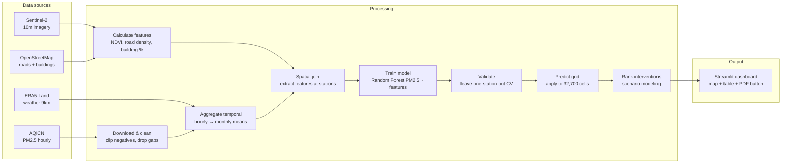

## The diagram

---

## Component descriptions

- **AQICN PM2.5**
  - What it provides: Hourly PM2.5 measurements (µg/m³) from ~10 Krakow stations, 2019-2024
  - Which sub-question(s) it serves: Sub-Q 1 (where worst), Sub-Q 3 (effect sizes), Sub-Q 5 (uncertainty)
  - Format / cadence: JSON via REST API, hourly updates, historical bulk download via date loop
  - Datasheet: `docs/datasheets/aqicn-pm25.md`

- **Sentinel-2 imagery**
  - What it provides: 10-meter multispectral satellite images, 13 bands, 5-day revisit
  - Which sub-question(s) it serves: Sub-Q 2 (what correlates - greenness), Sub-Q 3 (effect sizes)
  - Format / cadence: GeoTIFF via Google Earth Engine Python API, monthly composites (cloud-filtered)
  - Datasheet: `docs/datasheets/sentinel2-imagery.md`

- **OpenStreetMap**
  - What it provides: Vector geometries (polygons for buildings, lines for roads)
  - Which sub-question(s) it serves: Sub-Q 2 (what correlates - density), Sub-Q 3 (effect sizes)
  - Format / cadence: GeoJSON via Overpass API or OSMnx library, current snapshot
  - Datasheet: (not required for secondary sources per template)

- **ERA5-Land weather**
  - What it provides: Hourly temperature, wind, boundary layer height at 9km resolution
  - Which sub-question(s) it serves: Sub-Q 3 (control variables for model)
  - Format / cadence: NetCDF via CDS API, monthly bulk downloads
  - Datasheet: (not required for secondary sources)

### Processing 

- **Download & clean**
  - **Input:** Raw API responses (JSON, GeoTIFF, GeoJSON, NetCDF)
  - **Output:** `data/raw/` files (AQICN CSV, Sentinel-2 TIF stack, OSM GeoJSON, ERA5 NC)
  - **Transformation:** Clip negative PM2.5 to 0, drop flatline periods, standardize timestamps to UTC, reproject to EPSG:32634

- **Calculate features**
  - **Input:** Sentinel-2 bands (B2, B4, B8, B11), OSM vectors
  - **Output:** `data/processed/features_100m.tif` (7-band raster: NDVI, NDBI, NDWI, road_density_100m, road_density_500m, building_density, distance_to_major_road)
  - **Transformation:** Band math for indices, vector → raster for OSM (km/km² for roads, % coverage for buildings)

- **Aggregate temporal**
  - **Input:** AQICN hourly CSV, ERA5-Land hourly NC
  - **Output:** `data/processed/aqicn_monthly.csv`, `data/processed/era5_monthly.csv`
  - **Transformation:** Group by station + year-month, compute mean (drop if <75% data present that month)

- **Spatial join**
  - **Input:** AQICN monthly CSV (10 stations × 60 months), features_100m.tif
  - **Output:** `data/processed/training_data.csv` (~600 rows: station_id, year_month, pm25, ndvi, road_density, ...)
  - **Transformation:** For each station location, extract raster values at that coordinate

- **Train model**
  - **Input:** training_data.csv
  - **Output:** `models/rf_model.pkl` (Random Forest with 500 trees, max_depth=10)
  - **Transformation:** X = [ndvi, ndbi, road_density_500m, building_density, temp, blh], y = pm25, fit RandomForestRegressor

- **Validate**
  - **Input:** training_data.csv, rf_model.pkl
  - **Output:** `results/cv_scores.json` (R², MAE, RMSE per fold and overall)
  - **Transformation:** Leave-one-station-out CV (10 folds), record metrics, check if R² ≥ 0.40

- **Predict grid**
  - **Input:** rf_model.pkl, features_100m.tif (32,700 cells)
  - **Output:** `outputs/predictions_100m.tif`, `outputs/uncertainty_100m.tif`
  - **Transformation:** Apply model.predict() to all cells, compute prediction intervals via quantile regression

- **Rank interventions**
  - **Input:** predictions_100m.tif, features_100m.tif
  - **Output:** `outputs/intervention_ranking.csv` (scenario, delta_pm25, uncertainty)
  - **Transformation:** Modify features (e.g., NDVI +0.3 for green corridor), re-predict, compute difference from baseline

### Output 

- **Form:** Dashboard (Streamlit web app with interactive map, sortable table, PDF export button)
- **What the user does with it:** Planning analyst clicks on development site, reads predicted PM2.5, selects top 2-3 interventions from ranked table, clicks "Generate PDF", attaches PDF to zoning variance memo for committee.
- **Cross-reference:** see `output-sketch-v0.md` for the user-facing detail.

---

## Boundaries

### In scope

- Predict PM2.5 at any 100m grid cell in Krakow (with uncertainty ±8-30 µg/m³ depending on distance to stations)
- Rank 4 interventions (green corridor, traffic calming, green roofs, park) by predicted pollution reduction
- Generate 2-page PDF report with site map, current PM2.5, top 3 interventions, and limitations
- Quantify prediction uncertainty via cross-validation (R², MAE, leave-one-station-out error)
- Show interactive map where analyst can click any location and see prediction + contributing factors

### Out of scope

- No real-time forecasting (historical analysis 2019-2024 only, no "what will PM2.5 be tomorrow")
- No cost-benefit analysis (ranks interventions by impact, not € per µg/m³)
- No building-scale resolution (<100m predictions not validated)
- No causal proof (correlations only, not randomized experiments)
- No other pollutants (PM2.5 only, not NO₂, O₃, PM10)
- No personal exposure modeling (neighborhood averages, not individual daily exposure)

---

## Sign-off

**Team:** Rim, Martina, Rashi, Bhavana  
**Drawn by:** Rashi  
**Last updated:** 04-05-26
